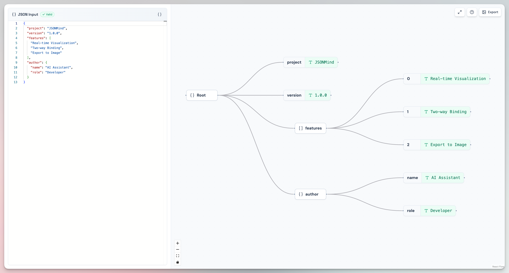

<div align="center">

# JSONMind

**Visualize JSON data as interactive mind maps in real-time**

English | [中文](./README.md)

[](https://react.dev/)
[](https://www.typescriptlang.org/)
[](https://vitejs.dev/)
[](https://tailwindcss.com/)
[](LICENSE)

</div>

---

## Introduction

**JSONMind** is a browser-based JSON visualization tool that renders JSON data into interactive mind maps in real-time. The left side features a built-in code editor, while the right side displays an interactive node graph. They work in perfect sync—as you edit JSON text, the mind map updates instantly. Conversely, hovering or selecting nodes in the mind map highlights corresponding code fragments in the editor.

> No installation needed. Just open your browser and start using it.

<div align="center">

  **Try it online: [jsonmind.cassdev.com](https://jsonmind.cassdev.com)**
  
</div>

## Interface Preview




## Features

### Real-time Visualization
- Input or paste JSON and see it **instantly rendered** as a hierarchical mind map
- Supports objects and arrays with arbitrary nesting depth
- Uses the **Dagre** algorithm for automatic layout computation, producing clean and elegant visualizations

### Bidirectional Binding
- Editor and mind map **synchronize in real-time**
- Hover over a node → editor automatically **highlights** the corresponding JSON fragment and scrolls to view
- Click a node → editor continuously highlights that path

### Visual Editing
- **Right-click menu**: Add child nodes, delete nodes, set to null, copy JSON path
- **Double-click nodes**: Inline edit node values or rename object keys
- **`+` button**: Click the quick action button next to container nodes to add children
- Support for five data types: `string`, `number`, `boolean`, `object`, `array`

### Export to Image
- Export the current mind map as a **PNG image** with one click
- Automatically captures the entire canvas content without manual scrolling

### JSON Path Display
- The status bar at the bottom displays the **JSON Path** of the currently selected node in real-time (e.g., `$.author.name`)
- Support for **copying** the path to clipboard with one click

## Quick Start

### Prerequisites

- [Node.js](https://nodejs.org/) >= 18
- npm >= 9 (or use pnpm / yarn)

### Installation and Running

```bash
# Clone the repository
git clone https://github.com/Cassius0924/JSONMind.git
cd JSONMind

# Install dependencies
npm install

# Start the development server
npm run dev
```

Open `http://localhost:5173` in your browser to start using it.

### Build for Production

```bash
npm run build
# Output is in the dist/ directory
npm run preview  # Preview the build result
```

## Usage Guide

### 1. Input JSON

Enter or paste JSON data directly into the left editor, and the mind map on the right updates instantly. The editor top displays ✅ **Valid** or ❌ **Invalid JSON** status, with detailed error messages shown at the bottom.

### 2. Browse the Mind Map

- **Scroll wheel**: Pan the canvas
- **Drag background**: Pan the canvas
- **Ctrl + Scroll wheel** or canvas controls: Zoom

### 3. Edit Nodes

| Operation | Method |
|-----------|--------|
| Modify node value | Double-click leaf nodes (split nodes), enter new value and press Enter |
| Rename object key | Double-click the key name label in an Object |
| Add child node | Right-click a container node → select type, or click the `+` button |
| Delete node | Right-click node → Delete, or select and press `Delete` / `Backspace` |
| Set to null | Right-click node → Set to null |

### 4. Node Type Legend

| Icon Style | Node Type |
|-----------|-----------|
| Gray border | Object |
| Gray border | Array |
| Green border | String |
| Blue border | Number |
| Yellow border | Boolean |

## ⌨️ Keyboard Shortcuts

| Shortcut | Function |
|----------|----------|
| `Tab` | Add child node to the currently selected container node |
| `Delete` / `Backspace` | Delete the currently selected node |
| `Ctrl/Cmd` + `Z` | Undo |
| `Ctrl/Cmd` + `Shift` + `Z` | Redo |
| `F11` / `F` | Toggle fullscreen mode |
| `Ctrl/Cmd` + `Shift` + `F` | Format JSON (requires editor focus) |

> **Note**: Except for the Format JSON shortcut within the editor, other shortcuts don't work when text input fields are focused.

## Contributing

We welcome Issues and Pull Requests!

1. Fork this repository
2. Create a feature branch: `git checkout -b feature/your-feature`
3. Commit your changes: `git commit -m 'feat: add some feature'`
4. Push to the branch: `git push origin feature/your-feature`
5. Submit a Pull Request

## License

This project is open-sourced under the [MIT License](LICENSE).

